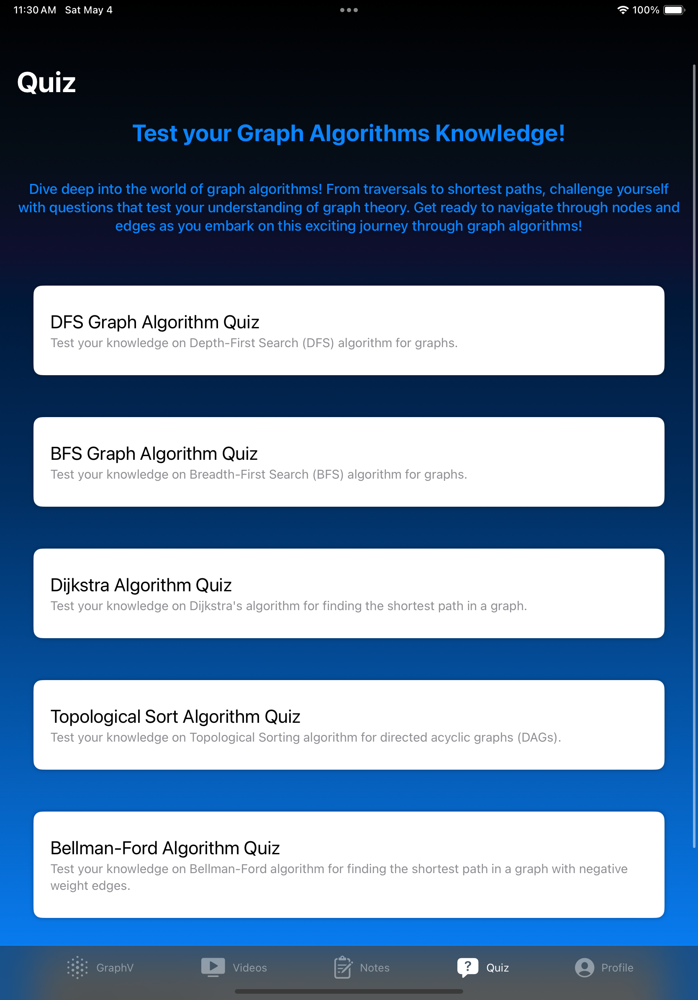

# GraphV-iOS

GraphV-iOS is an innovative educational iOS app designed to enhance students' understanding of graph theory concepts through interactive visualization and curated educational resources. The app offers a comprehensive learning experience, making complex graph algorithms more accessible and engaging for learners of all levels.

## Tech Stack

- **Frontend**: Swift, SwiftUI, UIKit
- **Backend**: Spring Boot, RESTful APIs, AWS (RDS, EC2), MySQL
- **Authentication**: Firebase Authentication, Google OAuth
- **APIs**: YouTube API for educational content

## Features

### 1. SignUp / SignIn
Users can register and log in securely using Firebase Authentication. The app supports email/password registration and login, as well as Google OAuth for a streamlined user experience.

### 2. Graph Visualizer
The Graph Visualizer allows users to create, manipulate, and explore graphs in real-time, providing a hands-on approach to learning graph algorithms and properties.

### 3. Curated Videos
GraphV-iOS integrates with the YouTube API to offer a curated selection of educational videos covering various graph theory topics. These videos provide visual and auditory learning opportunities, enhancing the educational experience.

  
   

### 4. Notes
The Notes feature allows users to take notes, organize their thoughts, and reflect on their learning journey. This feature supports personal insights and helps reinforce the concepts learned through the app.

  
   

### 5. Quizzes
The quiz section provides interactive assessments designed to test users' understanding of graph theory. This feature encourages active learning and self-assessment.

  
  
   

### 6. Profile
The Profile page allows users to manage their personal details and view their progress. Users can update their information and manage their learning preferences.

## Technical Details

### Backend and APIs
- **RESTful APIs**: Ensures efficient data exchange between the app and the server.
- **YouTube API**: Integrated to fetch relevant educational video content.
- **Spring Boot Backend**: Deployed on AWS to handle data retrieval and user management.
- **MySQL Database**: Hosted on AWS RDS for reliable data storage and management.

### User Authentication
- **Firebase Authentication**: Provides secure user registration and login.
- **OAuth Integration**: Allows users to register and log in using their Google accounts.

### User Interface
- **MVVM Pattern**: The app follows the Model-View-ViewModel design pattern, ensuring a clean separation of concerns and enhancing maintainability.
- **ScrollView Implementation**: Used for displaying notes, videos, and quizzes, ensuring a smooth user experience.

## Future Scope

- **Collaborative Features**: Introducing features that allow users to collaborate on graph projects, share insights, and learn from peers.
- **Advanced Graph Analysis Tools**: Plans to include tools for clustering, centrality analysis, and other advanced graph metrics to deepen users' analytical skills.
- **Accessibility Improvements**: Enhancing the platform's accessibility to cater to diverse learning styles and abilities.

## Conclusion

GraphV-iOS aims to revolutionize the way students learn graph theory by combining dynamic graph manipulation with rich educational resources. Our goal is to foster a deeper understanding of graph algorithms and make learning more interactive and enjoyable. We are committed to continuous improvement and innovation, with plans for future enhancements to further enrich the educational experience.

**Happy Coding!**
